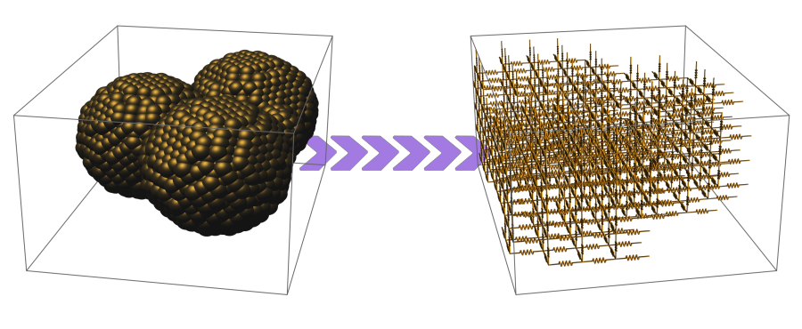

# AR-ERN

## Version

v2.1-β (01/03/2022) - First version released on GitHub

## Intro

*Atomically Resolved Equivalent Resistor Network* (AR-ERN) is a python program that calculates the electrical resistance of nanostructured systems from their molecular structure.

## Content

- *run.py*: the file  to run; it contains the setup of the calcualtion,
- */src/*: a folder containing the source code,
- */input_example/*: a folder with an example of atomic coordinate files to use as input

## How to use

Running AR-ERN requires Python 3 or later versions.
The *run.py* file contains the set up of the calculation and the copy here is set to work with the files in the */input_example/* folder. To adapt it to your case, follow the instructions below.
To initiate the AR-ERN code use the command
```
> python3 run.py
```
This will create a new folder */AR-ERN_output/* with the data output files and a log file with a copy of the *run.py* file and the on-screen messages printed during the run.
During the evaluation it will:  
1. read the input file with the atomic coordinates,
2. create a grid with given number of cells embedding the system,
3. decide if each cell is empty or filled with matter in a certain phase,
4. assign a conductance value along the three axes (i.e. conductance for current along the x-axis, etc.) to each cell, effectively creating a resistor network equivalent to the input system,
5. iteratively solve the circuit equations for such a resistor network,
6. calculate the resistance of the network, which represents the system estimated resistance.

## Input files

AR-ERN reads *.xyz* files with atomic coordinates as created by LAMMPS, namely with the following per atom information:
atom type, x-coordinate, y-coordinate, z-coordinate.
For the analysis of the cell phases, the potential energy for each atom might also be required, and therefore AR-ERN has been designed to also read a file with the following per atom data:
atom type, x-coordinate, y-coordinate, z-coordinate, potential energy
which is here called *.xyz.pe* file. 
To make such a file using LAMMPS, just add the following lines to your LAMMPS input file:
```
compute  pe all pe/atom
dump pe_xyz all custom 1 structure_example.xyz.pe type x y z c_pe
run 0
undump pe_xyz
uncompute pe
```
Examples of both *.xyz* and *.xyz.pe* files for the same structure (a simple system of four gold nanoparticles) are contained in the */input_example/* folder.

## Output files

During the run, AR-ERN creates several data files that store the relevant information, namely,
- the cell phases,
- the cell conductances,
- the estimated resistance of the system at each step of the iterative procedure used to solve the circuit equations,
- the node voltages of the equivalent resistor network at the end of such a procedure.

## Setting up the calculation via the *run.py* file

The file *run.py* provided reads the structure from the */input_example/* folder and all parameters therein are tuned accordingly. To chose the best set up for your system, we suggest the following procedure.

### Step 1 - set your coordinate file
Use  `coordinate_file` to enter the name of the file with the atomic coordinates of the system you want to analyse.
Two extensions are recognised: *.xyz* and *.xyz.pe*.
Example of formatting is provided in the  */input_example/* folder.

### Step 2 - chose the grid size
Set `mode='grid'`. In this way the code will only read the input file and create a grid.

Set the number of cells that will make up the grid embedding your system along the three axes using `grid_size`.
The size of the cell will be determined according to the equipartition of the space occupied by the system. You can check the resulting cell size by running *run.py* and read the on-screen messages or the log file.

In choosing the number of cells, one has to consider that, although in general the calculation should be converged with finer grids, there is a limit to the fineness of the grid after which the representation as resistor network loses physical sense. For the system in the example, the nanoparticles are roughly four spheres carved out of an fcc lattice of pace ~4Å. The limit on fineness of the grid is roughly 13x18x3 cells, which corresponds to a cell of ~ 5Åx5Åx5Å. For finer grids, the cell pace becomes lower than the lattice pace and one can no longer meaningfully assign a phase to the grid cells.

To start off, we suggest to set the number of cells just above this limit for the system under exam, as done in the example. If later will be realised that the calculation takes too long, the number of cells can be reduced appropriately.

### Step 3 - chose the method for assigning the phase
Set `mode='phase'`. In this way the code will do one step more and assign a phase to each cell.

By "cell phase" here is meant whether the cell contains atoms mostly in either their pristine crystalline configuration ("crystalline phase"), or in some other configuration (e.g., surface atoms) or no regular configuration at all, both deemed as "amorphous phase"; if the cell contains (almost) no atoms at all, we say the cell is in the "vacuum" phase. Whether a cell is one phase or another is here determined using two alternative methods, one based on the atomic density and the other on the atomic potential energy. 

According to the first method, if the density of atom of a non-empty cell is above a certain threshold then the cell is considered in the crystalline phase, otherwise is considered amorphous, while only empty cells are considered in vacuum phase.

According to the second, given the set of potential energies of each atom in an non-empty cell, if the standard deviation of the set rescaled by the set mean, in absolute value, is below a certain threshold, the cell is in crystalline phase, otherwise is in the amorphous one; vacuum phase is attributed only to empty cells.

Set `phase_assignment_method='density'` for the former method or `phase_assignment_method='potential energy'` for the latter. In general, the method based on the potential energy is expected to be more precise, so use that if you can (i.e. you have the possibility of making a *.xyz.pe* file). In fact, neither method is extremely precise in all situations, but they are both faster than more sophisticated ones.

More importantly, a value for the above mentioned thresholds must be chosen and, if one has no indication of what it could be for the system of interest, the choice must be determined by comparing the phase analysis performed by the code with a benchmark. By assigning a value to `phase_assignment_threshold`, one can run the code and see how much crystal, amorphous and vacuum phases have been detected by reading the on-screen messages, or the log file. A detailed analysis is possible by reading the *…_phases.csv* file contained in the */AR-ERN_output/* folder in which the phase attributed to each cell is stored.

### Step 4 - chose the conductance of the cells
Set `mode='conductance'` to perform all previous steps and add the creation of the equivalent resistor network.

In the classical regime, the conductance (G) of each cell would only depend on the cell phase and its size. When quantum effects arise, the conductance of each cell also depends on nearby cells. In the current version, it is possible to assign conductances in the classical way, with the function `G_classical(phase,section,length)`, or considering the ballistic as the dominant transport, with  `G_classical(phase,section,length)`. A comparison between the cell size and the electron mean free path in all matter phases, which is set in the dictionary `mean_free_path`, determines which regime (classical or  ballistic) to use. 

Having decided the conductances for all cells determines the resistor network equivalent to the given molecular structure.

### Step 5 - chose the parameters of the iterative procedure to solve the circuit equations
Set `mode='full calculation'` to performe the entire calculation.

The circuit equations are completed once the applied voltage (`Volt`) and the orientation of the electrodes (`electrode_axis`), which can be chosen to be along the x- or the y-axis, have been decided. Notice that changing voltage only involves a rescaling of the solution (the node voltages) and does not affect the final resistance estimate. Furthermore, keep in mind that the electrodes extend over two parallel planes perpendicular to the x-y plane and placed at two opposite boundaries of the grid.

The iterative procedure is initialized (`how_to_initialize_V`) with a certain "attempted solution"; by default, one can chose either the `'ramp'` solution, suitable for systems with low porosity (i.e. percentage of vacuum phase), or the `'steps'` one, suitable for systems with high porosity.

The procedure is parallelized and one can chose the number of CPUs to deploy (`cpu_to_use`). With the current implementation, the highest speed up is likely to correspond to about 20 CPUs invoked.

Finally, one has to set the number of the iterations to perform (`iterations`). Notice that the procedure can converge with a very slow pace and the difference between two consecutive values of the estimated system resistance can be orders of magnitude lower than the error with respect to the actual converged result.

## Citing this code

If you use this program for your work, please cite this paper:
> M. López-Suárez , C. Melis , L. Colombo , and W. Tarantino <br>
> *Modeling charge transport in gold nanogranular films* <br>
> [Phys. Rev. Materials **5**, 126001 (2021)](https://doi.org/10.1103/PhysRevMaterials.5.126001)

## Authors and contacts

The author of this tool is Walter Tarantino.
For questions, bug reports or other suggestions please contact [walter.tarantino@dsf.unica.it](mailto:walter.tarantino@dsf.unica.it), or, better, open an [issue](https://github.com/tarwal/AR-ERN/issues).

## Licence

This project is licensed under the  [GPL license, v3](https://www.gnu.org/licenses/gpl-3.0.en.html) - see the LICENSE file.
